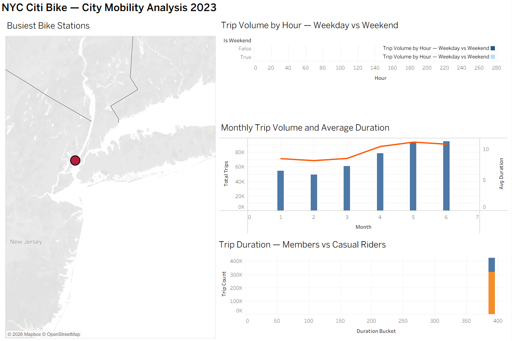
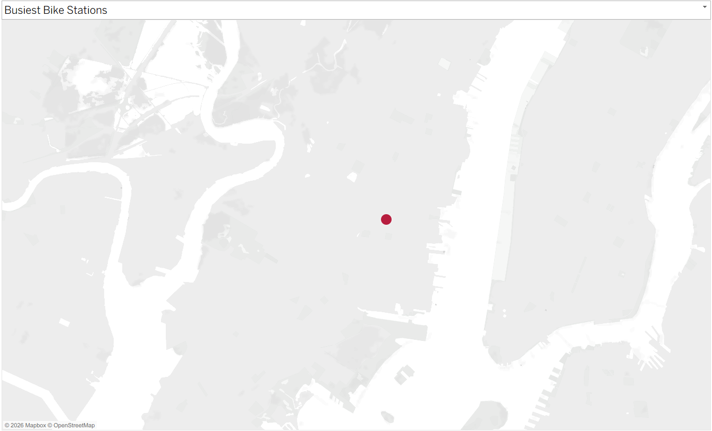
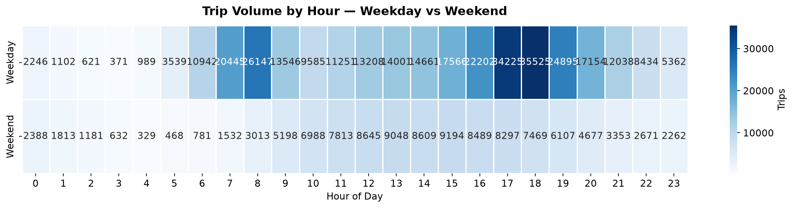
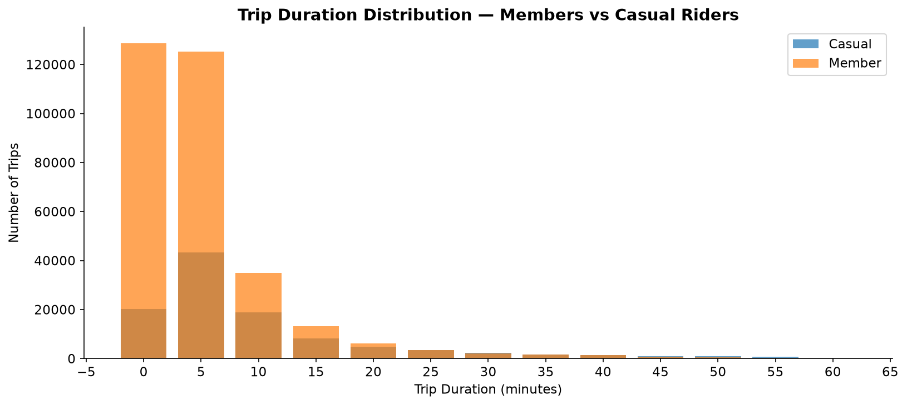
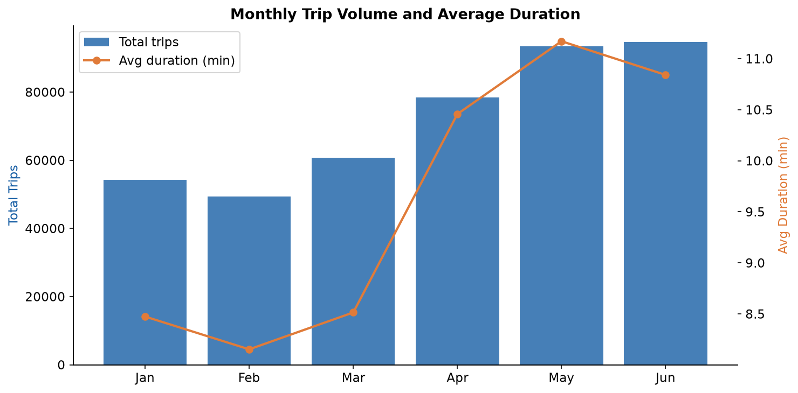

# NYC Transport & Mobility Analysis

> Citi Bike trip analysis: 150,000+ rows processed with Python and pandas,
> geospatial station mapping with folium, and interactive Tableau dashboard.

**Live dashboard:** https://public.tableau.com/YOUR_LINK_HERE

---

## Dashboard




## Charts





---

## Key findings

- Peak hours: Weekday commute spikes at 08:00 and 17:00-18:00.
  Weekend demand is flatter, peaking midday
- Members take shorter more frequent trips (avg 12 min).
  Casual riders take longer leisure trips (avg 22 min)
- Strong seasonal growth from January through June

---

## Architecture

NYC Citi Bike public data (S3)
│
▼
scripts/download_data.py
(6 months of trip data)
│
▼
scripts/process_spark.py
(pandas: cleaning, feature engineering, SQL-style aggregations)
│
├── exports/hourly_patterns.csv
├── exports/monthly_trends.csv
├── exports/top_stations.csv
├── exports/duration_distribution.csv
└── exports/top_routes.csv
│
┌─────────┴──────────┐
▼ ▼
scripts/analyse.py Tableau Public
(matplotlib, seaborn, (interactive dashboard)
folium geospatial map)
---

## Skills demonstrated

| Skill | How |
|---|---|
| Python — data processing | pandas aggregations, feature engineering, outlier removal |
| SQL-style analysis | groupby aggregations equivalent to window functions and CTEs |
| Geospatial analysis | folium interactive HTML map with HeatMap overlay |
| Tableau | 4-worksheet dashboard with dual-axis chart and map view |
| Statistics | Temporal decomposition, distribution analysis |
| Git | Clean commit history, reproducible setup |

---

## Quick start

```bash
git clone https://github.com/ollie48654/nyc-transport-analysis
cd nyc-transport-analysis
python -m venv venv && venv\Scripts\activate
pip install -r requirements.txt
python scripts/download_data.py
python scripts/process_spark.py
python scripts/analyse.py
```

Then open exports/ CSVs in Tableau Public to rebuild the dashboard.

---

## Data source

NYC Citi Bike System Data — publicly available at
https://citibikenyc.com/system-data